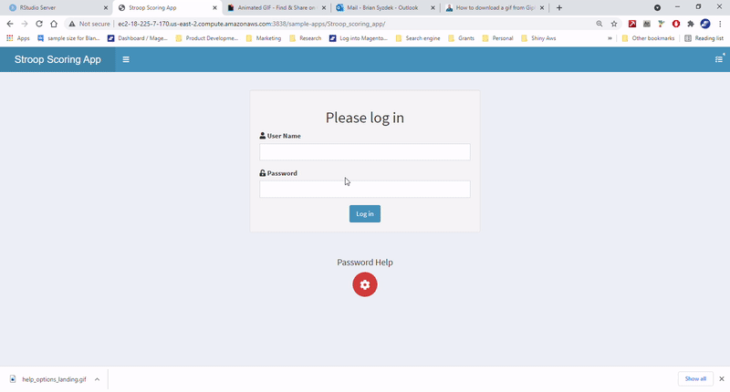

```{r setup, include=FALSE}
knitr::opts_chunk$set(echo = FALSE)
library(gifski)
library(knitr)
library(jpeg)
library(grid)
library(gridExtra)
source("shiny_helper_functions.R")
```

# Introduction

The Stroop Scoring Application is a web-based application that will help score and interpret Stroop Color and Word Test (Stroop) data, provide dynamic interpretation--text-based and graphical, and provide record management--saving records, restoring past records, and performing batch score analysis. An internet connection and authorized user log-in information is required to use the app.

## Help 
This help document will guide users through how to access the application, score a new assessment, interpret results, generate a report, save a session, load a previous session, and score multiple records. Stoelting is available at anytime to answer questions or provide consultation about use of this application.

### Help Within App

Users can access help at anytime when using the app through the help options in the upper right hand corner of the application.


*** 

# App Access and Password Management

## Sign-in

### App Location

Users can access the application through the Stroop webpage at [Stoelting Psychology's website](https://stoeltingco.com/Psychological-Testing). 

At the landing page, users can enter their password information to use the app or manage their password information.


### Enter Log-in Information

To use the app, enter your current User Name and Password combination in the Log-in box and click "Log-in."



If an incorrect User Name and Password combination is entered, a message "Invalid username or password!" will be displayed.

### Password Management

Users can 1. retrieve a password, 2. reset a password, or 3. reset password retrieval questions/answers. To do any of these options, click "Password Help," then follow click relevant dropdown menu option.

You should follow best-practice procedures for password creation and retrieval management.

#### Retrieve Password

Clicking "Forgot Password" will prompt to enter User Name. If there is not a record of an existing User Name, an error message will display. Users will need to re-enter a correct User Name or contact Stoelting for assistance. If a registered User Name is entered, users will be shown their password retrieval question and be prompted for an answer. Upon successful entry of appropriate value, the password will be displayed.


#### Reset Password

You can change your password by clicking "Reset Password." Enter a correct User Name and Password, then enter your new password. If nothing is entered, the password will be rejected. If a valid password is entered, you will be notified. You will need to reload the app for the password change to take effect.


#### Change Retrieval Question and Answer

You can change the question and answer combination used to retrieve a forgotten password. Click "Resent Password Retrieval Question." Enter your correct User Name and Password. Then enter a new question and answer to retrieve your password. You will be notified of the change. You must reload the app for the change to take effect.


You can return to this password management/login screen at any time by clicking "Logout/Password Management" button in the upper right corner of the app. WARNING: All unsaved data will be lost if you logout.


# App Use

## Overview


After successful password entry you will be redirected to the main parts of the app. They are:

1. Sidebar- has tabs you can select for main page. Sidebar can be toggled on or off by clicking three vertical bars above right of it.
  Tabs:
  a. Scoring Information
  b. Interpretation
  c. Reports and Records
2. Demographic Information- All information can be entered by the user for a new record, uploaded from a previous session and changed. All this informaiton is optional.
3. Main Page- This will change based on which tab is selected (a-c above). Each of the main page tabs is reviewed next:

## Scoring Information Page


The Scoring Information Main Page contains
1. Essential Information Input- All this information is required to compute standardized scores. It can be entered as a new record or reloaded from a previous session.
  a. Word Raw Score
  b. Color Raw Score
  c. Color-Word Raw Score
  d. Highest Education Completed
  e. Birth Date
  f. Test Date
  g. Age (automatically calculated from birth and test date)
2. Score Table Summary- for Word, Color, Color-Word, and Interference Scales, the app will automatically calculate Predicted, Residual, and T-Score values
3. Plot of Scores- The app will automatically construct a bar plot of the T-Scores of scales in the table above. The plot shows bands of significance at +/- 1 and 2 SD from mean.


As can be seen inputting raw scores will automatically update the table and plot. In the table, Predicted Scores are not updated by changing scores, as they are a function of age and education. Residual is Raw Score - Predicted and T-Scores are obtained by obtaining the appropriate T-Score from the same table in the manual. The Raw Scores can be changed at any time with updates automatically being processed.

## Interpretation Page

The Interpretation Page provides further analysis of each scale. The order of scales interpreted is the order typically of interest for Stroop use:

1. Interference
2. Color-Word
3. Color
4. Word


Within the row for interpretation of each scale, a narrative text and plot is displayed. The narrative text and plot update dynamically based on user input, providing meaning for the T-scores obtained for each scale.

## Report and Record Management Page

This page allows users to generate a report of a session, save sessions, and restore records.


I) Current Session Report and Save
1. Generate Report
  a) Choose Report Format
  b) Generate Report Button
  
  2. Save Current Session
II. Restore Previous Session
  3. Choose method of uploading records
  4. Data Display
  a) All uploaded records
  b) Selected records- optionally below invalid data
      i. Restore Selected Record
      ii. Save All Records
      iii. Download Multiple Record Template

### Current Session

Options in this row are for data that is active in the app fields. The data could have been entered manually, as a new record, or loaded from a previous session.

#### Generate Report

You can generate a report that summarizes much of the information presented in the application- standardized scores, user information, and summary text and plots. Description of the output options for each report are: 

```{r table2, echo=FALSE}
library(kableExtra)
output_table <- data.frame(HTML = c("Interactive <br> Optimized viewing on screen", "Printing not standard",
                                    "For review on computer <br> Printed report not as nice as other formats"),
                           PDF = c("Nice printing", "Not interactive <br> Can't change text", "No changes necessary and paper report desired"),
                           `Word/DOCX` = c("Can make text changes", "Not interactive", "Paper report desired with changes"))
row.names(output_table) <- c("Strengths", "Weaknesses", "Suggested Use")
output_table %>%
      kable("html", escape = F) %>%
      kable_styling(bootstrap_options = c("striped", "hover", "condensed", "responsive"))
```

Choose desired output format, then click "Generate Report." A report will be generated using active information from the input fields of the application. The report will be generated in the typical location in which reports of your chosen format are placed. Often that is in a Downloads folder if using Windows. You can then view and save the report to your desired location. Please note that these reports do not save user data to restore this record within the app and should be kep in a folder separate from records to restore. You will use a .csv or .xlsx file (Excel file) for that, described next.


##### Sample Reports

```{r, echo=FALSE}
htmltools::tags$iframe(title = "HTML Example Report", src = "images/stroop_report_Stevenson_Stewart_.html", width="100%", height="600%")
```

* HTML Report (see above)
* [PDF Report](https://www.stoeltingco.com/Psychological/media/stroop_report_Stevenson_Stewart _.pdf)
* [Word/DOCX Report](https://www.stoeltingco.com/Psychological/media/stroop_report_Stevenson_Stewart _.docx)

#### Save Current Session

You can save the current session. All input data will be saved into a .csv file. This file will download to your computer. It is recommended that you then store this file in a folder dedicated to saving these session records, and no other files. You can restore one of these saved .csv files to display all entered data and generate reports. You could also load a previous session if you wish to change some values and re-save, such as if you are re-administering to an individual and much of the information is unchanged.


### Restore Previous Session

You can restore data from a previous session for analysis, individually or as a group of records. 

#### Upload

First, choose the method/type of input for uploading data.


The three methods for restoring data are:

* Folder- Upload all files in a folder. Most people who have saved individual records in a dedicated folder will choose this method. The entire contents of the folder are uploaded to the "Available Records" table, from which the user can select the preferred record.
* Individual- Upload a selected .csv file. If the user knows the specific record he wishes to upload, this option can be selected to upload an individual record. 
* Multiple Records One File- Records that have been combined into one file or input as one file, can be uploaded as one file.

##### Folder

Select "Folder" and click "Choose Folder" to upload all files from a dedicated folder. This is useful to be able to see details of all available records to select the records you wish to restore. 


It is not shown in the above .gif, but when navigating to your folder to upload, that folder __must__ appear as selected in the Folder name before choosing "Upload." If you navigate into that folder it typically will be, but if the Choose Folder explorer opens within that folder it may not. Just click the name of that folder in the file explorer address bar to select it.


Confirm to upload all the files. The files will then be uploaded and the records will be displayed in "Available Records" table.

__NOTE__: Do not have any of the files in the selected folder open. Windows creates a temporary file with the same name in the same folder, but without valid data. You will get an error message if you do this. Close all files and try again.

##### Individual

Users can select an individual file to upload from their files. Valid Stroop app record file names are all of the pattern "client-name_time_stroop_data.csv." Files of this naming scheme are the only ones valid to upload.


Note in the above image that one of the files ends in .xlsx. This is not a valid file to upload. Also, the other files have the same name, which may represent multiple testing of that individual. For these reasons, uploading the folder, which displays all testing data is recommended.

When the chosen record is uploaded it will display in Available Records. Note that even though it is the only record, it still must be selected to "Selected Records" table to be restored.

##### Multiple Records One File

Users can select a file that contains multiple records. These multiple records may have been output from the app (see below) or manually entered into a file. This file will be a .xlsx file. There are no naming restrictions otherwise. When this file has been uploaded all records will display in Available Records.

#### Selecting Records

Once records have been uploaded to "Available Records," desired records must be selected to appear in "Selected Records." The Selected Records table is the table from which operations is referred. Single or multiple records can be selected to Selected Records, depending on desired operation, as described as follows.

Users can search Available Records using the search bar, sort records by clicking Ascending/Descending carats above a desired column field, and scrolling through records and pages, and choosing number of records to display to find desired records. Records are selected/deselected by clicking anywhere within the row.


##### Selected Record Editing

Selected Records may be edited directly by choosing desired cell and typing in desired value. There are restrictions on what constitutes valid data. The restrictions are:

```{r valid_data}
data.frame(
  Input = c("word_raw_score", "color_raw_score", "color_word_raw_score", "education", "birth_date", "test_date"),
  Restriction = c("Non-negative Integer", "Non-negative Integer", "Non-negative Integer", "Of one of the values (exact spelling) in education drop down menu", "Date in 'MM/DD/YYYY'", "Date in 'MM/DD/YYYY'")
) %>%
  table_print(caption = "Valid Input Data", colnames = colnames(.), output_format = "html")
```

If any of these requirements are not met, a table will appear below Selected Records showing invalid records and the invalid data. Invalid data are column names appended with "_validated." If data is invalid, "Problem Value" will appear. Fix that cell in Selected Records. Valid data show the data within those cells. When there are no invalid data, records will disappear.


#### Restore Selected Record

You can restore an individual session from Selected Records. This will populate all input fields with saved data. You can then generate reports or modify data. 

You must select exactly one of the records in Selected Records. Select a record by clicking on the row number. That will highlight the entire row. Then click "Restore Selected Record."


#### Save Multiple Records to One File

You may wish to save multiple records to one file. All records will be output, along with standardized scores. This may be useful for research as you will have a format with all records ready for analysis. 

The records that are in Selected Records will all be converted. You do not need to select those records (and can't select more than one). Click "Save All Records" when you have desired records that you wish to combine. This will output a .csv file with converted scores. 

__NOTE__: This file cannot be uploaded as an individual files. It is similair to a report in that it is an end product. To generate a file to upload multiple users, use the template (next).

#### Generate a Template for Multiple Records

You can generate a template that you can use to input data for multiple records. The template fields are restrited to valid values. Click "Download Multiple Record Template," edit that template, save, and then upload that template for either multiple record conversion or to convert files individually (see above "Multiple Records One File" for upload instructions).

#### Add a new record to Selected Records

Selected Records will always add a new row to the last row of data. That is so you can add an additional record manually. Type into the cells the desired values. A new row will appear after this. You can ignore the blank row. It will be removed for any data analysis.

# Conclusion

This concludes the help document.  Hopefully, this information will help you to be able to use the Sattler-Stoelting Developmental Checklist Application.  The application and reporting system offer a great deal of features, convenience, and design for generating a great deal of information about a client and being able to review that information.  Clinicians should be able to identify areas to target in treatment immediately and generate a holistic picture of clients.

Stoelting is always available and eager to help with the application or any other issues.  Please contact us below.

## Contact Information
```{r, echo=FALSE, message=F, warning=F, fig.align="center", out.width= '50%', out.height= '50%'}
# Add logo to output
library(jpeg)
library(grid)
library(gridExtra)
url <- "https://stoeltingco.com/Psychological/media/stoelting_logo.jpg"
z <- tempfile()
download.file(url,z,mode="wb")
img <- readJPEG(z)
rimg <- rasterGrob(as.raster(img)) # raster multilayer object
tg <- textGrob("Stoelting Psychology", gp=gpar(fontfamily = "serif", fontsize = 20))
sg1 <- textGrob("www.stoeltingco.com", gp=gpar(fontfamily = "sans", fontsize = 10))
sg2 <- textGrob("620 Wheat Lane", gp=gpar(fontfamily = "sans", fontsize = 10))
sg3 <- textGrob("Wood Dale, IL, USA 60191", gp=gpar(fontfamily = "sans", fontsize = 10))
sg4 <- textGrob("psychtests@stoeltingco.com", gp=gpar(fontfamily = "sans", fontsize = 10))
sg5 <- textGrob("630-860-9700", gp=gpar(fontfamily = "sans", fontsize = 10))
lay <- rbind(c(1,NA),
             c(1,NA),
             c(1,NA),
             c(1,NA),
             c(1,2),
             c(1,3),
             c(1,4),
             c(1,5),
             c(1,6),
             c(1,7),
             c(1,NA),
             c(1,NA),
             c(1,NA),
             c(1,NA))
grid.arrange(rimg, tg, sg1, sg2, sg3, sg4, sg5, layout_matrix = lay)
grid.rect(width = 1.5, height = .5, gp = gpar(lwd = 2, col = "blue", fill = NA))
```
&nbsp;

<!-- html contact links footer -->
```{r contact_info, echo=FALSE, results= 'asis'}
  cat("<p style=\"text-align: 
      center;\">Copyright 2021:<a href=\"https://www.stoeltingco.com\" target = \"_blank\">Stoelting</a></p>")
  cat("<p style=\"text-align: center;\"><a style=\"color: #0645AD;\" href = \"mailto:psychtests@stoeltingco?subject = Stroop App&body = Message\"><em>Email Stoelting for support</em></a></p>")
```